**프로젝트 개요**

| Re:Flow는 블록체인 기술을 활용한 투명한 기부 플랫폼입니다. 기부자(Donor)가 기부 토큰(DNT)을 구매하여 지역 기반으로 기부하면, 수혜자(Beneficiary)는 해당 토큰으로 제휴 상점에서 물품을 구매할 수 있습니다. 모든 기부 흐름은 이더리움 호환 블록체인에 투명하게 기록됩니다.

- **플랫폼**: 웹 (React + Vite 기반 프론트엔드) 및 Spring Boot 백엔드, 블록체인(Hardhat) 모듈, AI(파이썬) 모듈
- **개발 기간**: 2026.02.19 ~ 2026.04.03
- **개발 인원**: 6명

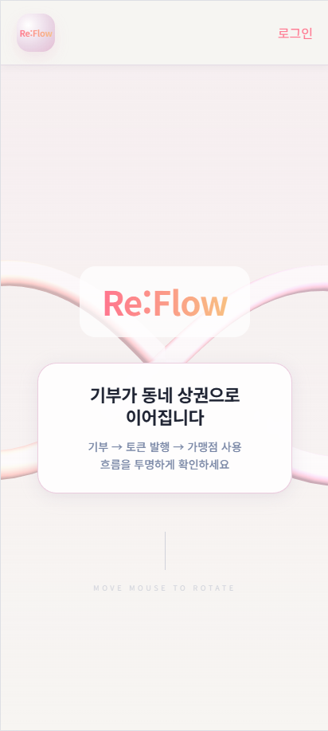

---

**팀원 구성**


---

**Getting Started**

- **사전 준비**
  - JDK 17 이상 (백엔드 빌드/실행용)
  - Node.js (권장: v18+ / 프로젝트는 `react@19`, `vite@8` 사용)
  - npm 또는 yarn
  - Python 3.10+ (AI / FDS 모듈)
  - Docker & Docker Compose (Infra 로컬 테스트/배포 시)

- **실행 방법 (로컬)**
  1. 레포 다운로드 및 루트로 이동
     - `git clone <REPO_URL>`
     - `cd S14P21A103`

  2. 백엔드 실행 (Spring Boot)
     - Windows: `backend\\gradlew.bat bootRun`
     - macOS / Linux: `cd backend && ./gradlew bootRun`
     - 또는 빌드: `./gradlew build` 후 `java -jar build/libs/*.jar`

  3. 프론트엔드 실행
     - `cd frontend`
     - `npm install`
     - `npm run dev`

  4. 블록체인 (로컬 테스트 네트워크)
     - `cd blockchain`
     - `npm install`
     - `npm run node` (Hardhat 로컬 노드 실행)
     - 배포: `npm run deploy:local`

  5. AI / FDS 모듈 실행 (선택)
     - `cd fds`
     - `python -m venv .venv && source .venv/bin/activate` (Windows: `.venv\\Scripts\\activate`)
     - `pip install -r requirements.txt`
     - 예시 실행: `python app/main.py` (프로젝트에 맞게 조정)

- **접속 정보 (로컬 기준)**
  - 프론트엔드: http://localhost:5173 (Vite 기본 포트, `npm run dev` 실행 시)
  - 백엔드 API: http://localhost:8080 (Spring Boot 기본 포트)
  - Hardhat 노드: http://127.0.0.1:8545

- **환경 변수 및 인프라 가이드 (대표 항목)**
  - `DATABASE_URL` 또는 각 DB 관련 설정 (Postgres 연결 정보)
  - `REDIS_URL` (Redis 사용 시)
  - `JWT_SECRET` (토큰 발급/검증용)
  - `WEB3_RPC_URL` (블록체인 RPC 엔드포인트)
  - `SPRING_PROFILES_ACTIVE` (dev / prod 프로필)
  - `S3_*` 또는 외부 스토리지 관련 설정 (이미지/자산 업로드 시)

  (구체적인 변수는 [backend/application.yml](backend/application.yml#L1) 및 배포 스크립트를 참조하세요.)

---

**Tech Stack (상세)**

프론트엔드 (frontend/package.json 기반)

| 패키지                |                용도 |           버전 |
| --------------------- | ------------------: | -------------: |
| react                 |       UI 라이브러리 |         19.2.0 |
| react-dom             |    React DOM 렌더러 |         19.2.0 |
| vite                  |  개발 서버 / 번들러 | ^8.0.0-beta.13 |
| typescript            |      정적 타입 검사 |         ~5.9.3 |
| @tanstack/react-query |  데이터 페칭 / 캐시 |        ^5.95.0 |
| axios                 |     HTTP 클라이언트 |        ^1.13.6 |
| jsqr                  |      QR 코드 디코딩 |         ^1.4.0 |
| lucide-react          |   아이콘 라이브러리 |       ^0.577.0 |
| qrcode.react          |      QR 코드 렌더링 |         ^4.2.0 |
| recharts              |     차트 라이브러리 |         ^3.8.0 |
| zustand               |      전역 상태 관리 |        ^5.0.11 |
| clsx                  | className 조합 유틸 |         ^2.1.1 |
| tailwind-merge        |  Tailwind 병합 유틸 |         ^3.5.0 |

개발/빌드(프론트엔드)

| 패키지                                        |                    용도 |              버전 |
| --------------------------------------------- | ----------------------: | ----------------: |
| @vitejs/plugin-react                          |     Vite React 플러그인 |            ^5.1.1 |
| tailwindcss                                   | 유틸리티 CSS 프레임워크 |            ^4.2.1 |
| postcss, autoprefixer                         |     CSS 처리 파이프라인 | ^8.5.8 / ^10.4.27 |
| eslint, @eslint/js, eslint-plugin-react-hooks |                    린팅 |              ^9.x |

백엔드 (backend/build.gradle 기반)

| 라이브러리 / 툴                                   |                    용도 |                          버전/비고 |
| ------------------------------------------------- | ----------------------: | ---------------------------------: |
| Spring Boot (플러그인)                            | 애플리케이션 프레임워크 |                             3.5.11 |
| Java Toolchain                                    |         런타임 / 컴파일 |                                 17 |
| spring-boot-starter-web                           |                REST API |             Spring Boot BOM에 따름 |
| spring-boot-starter-data-jpa                      |       JPA (데이터 접근) |             Spring Boot BOM에 따름 |
| spring-boot-starter-data-redis                    |              Redis 연동 |             Spring Boot BOM에 따름 |
| spring-boot-starter-batch / quartz                |               배치 처리 |             Spring Boot BOM에 따름 |
| org.springdoc:springdoc-openapi-starter-webmvc-ui |      Swagger/OpenAPI UI |                             2.8.16 |
| io.jsonwebtoken:jjwt-api, jjwt-impl, jjwt-jackson |                JWT 처리 |                             0.12.6 |
| org.web3j:core                                    |    Web3 (블록체인 연동) |                             4.10.3 |
| postgresql (runtime)                              |             DB 드라이버 | (버전 미표기 - Gradle 런타임 의존) |
| lombok                                            |     보일러플레이트 감소 |                      (compileOnly) |

블록체인 (blockchain/package.json 기반)

| 패키지                                              |                       용도 |             버전 |
| --------------------------------------------------- | -------------------------: | ---------------: |
| hardhat                                             | 스마트컨트랙트 개발/테스트 |         ^2.22.17 |
| ethers                                              |        이더리움 라이브러리 |           ^5.8.0 |
| @openzeppelin/contracts                             |        표준 스마트컨트랙트 |           ^5.6.1 |
| typechain, @typechain/hardhat, @typechain/ethers-v5 |      타입 생성/타입 안전성 |     ^8.x / ^10.x |
| ts-node, typescript                                 |   개발용 TypeScript 런타임 | ^10.9.2 / ^4.9.5 |

AI / FDS (fds/requirements.txt 기반)

| 패키지                      |          용도 |                              버전/비고 |
| --------------------------- | ------------: | -------------------------------------: |
| fastapi                     | 경량 API 서버 |                               >=0.95.0 |
| uvicorn[standard]           |     ASGI 서버 |                               >=0.18.0 |
| python-dotenv               |     .env 로드 |                                >=1.0.0 |
| tensorflow, keras           |        딥러닝 | (requirements.txt에 명시, 버전 미지정) |
| numpy, pandas               |   데이터 처리 |              (requirements.txt에 명시) |
| sqlalchemy, psycopg2-binary |       DB 연동 |              (requirements.txt에 명시) |

인프라 / 운영 (참고)

- Docker / Docker Compose: 로컬 환경 및 배포용 (버전은 로컬 환경에 맞게 선택)
- 데이터베이스: PostgreSQL (버전은 배포/운영 환경에 맞게 선택)
- 캐시: Redis (선택 시)

---

**시스템 아키텍처**

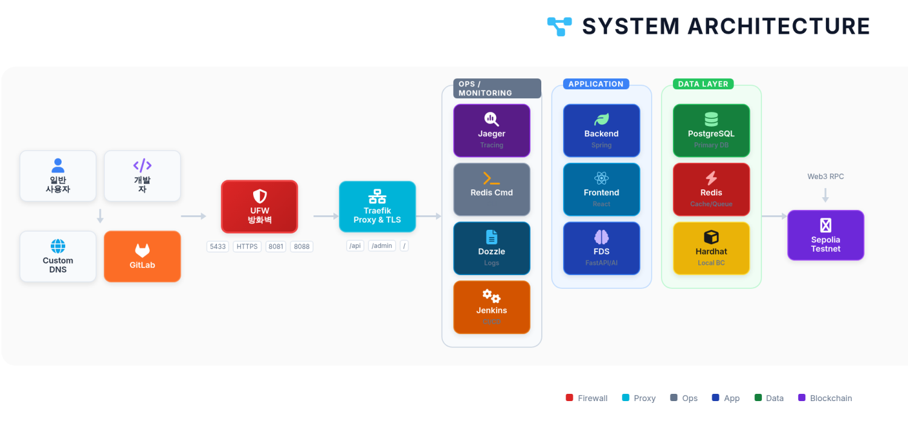

---

**기능 구성**

- 사용자
  - 회원가입 / 로그인 (JWT)

    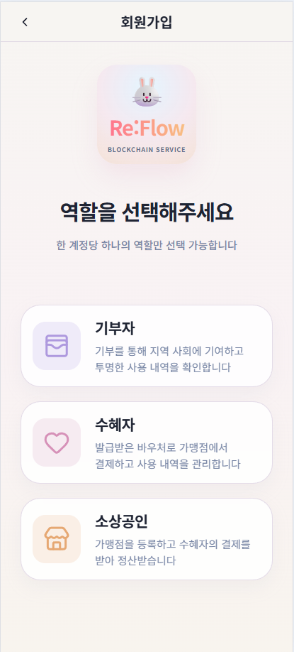

  - 지갑 연결 / 잔액 조회

    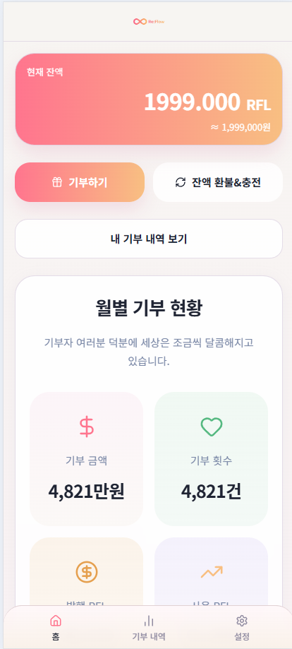

  - 토큰 충전 / 토큰 환불

    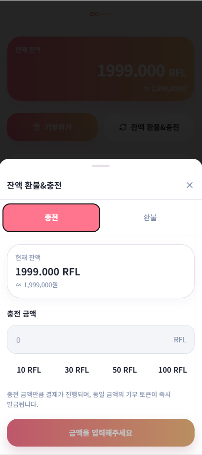

  - 기부 생성 및 상세 조회

    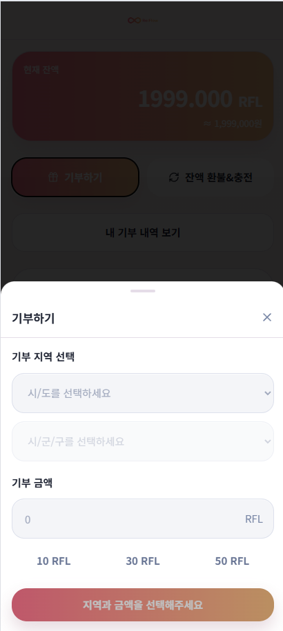

- 가맹점(매장)
  - QR 결제 처리 (PIN 입력 기반)

    
    

  - 정산 내역 조회

    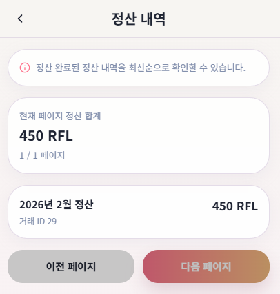

- 블록체인 연동
  - 온체인 트랜잭션 발행 및 검증

    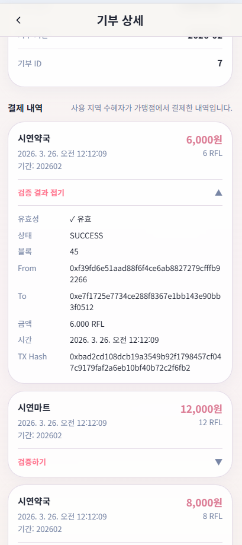

---

**디렉토리 구조**

**디렉토리 구조 (간단 요약)**

- Backend: `backend/`

```text
backend/
├─ build.gradle
├─ Dockerfile
├─ application.yml
├─ gradlew
├─ gradlew.bat
├─ settings.gradle
├─ src/
│  ├─ main/
│  ├─ java/com/
│  │  └─ domain/
│  │     ├─ controller/
│  │     ├─ service/
│  │     ├─ repository/
│  │     ├─ domain/
│  │     └─ dto/
│  └─ resources/
│     ├─ application.properties
│     └─ static/
└─ test/
```

설명: Java 코드는 도메인별 구조를 따릅니다. 각 도메인(e.g. user, donation, payment)은 `domain`(엔티티), `repository`(DB), `service`(비즈니스), `controller`(API), `dto`(입출력)로 나뉘어 관리됩니다.

- Frontend: `frontend/`

```text
frontend/
├─ package.json
├─ vite.config.ts
├─ index.html
├─ public/           (정적 자산)
└─ src/
   ├─ api/           (HTTP 호출 모듈)
   ├─ components/    (재사용 UI 컴포넌트)
   ├─ pages/         (페이지 단위 컴포넌트)
   ├─ layouts/       (레이아웃 컴포넌트)
   ├─ hooks/         (커스텀 훅)
   ├─ stores/        (전역 상태관리)
   ├─ styles/        (글로벌/유틸 스타일)
   └─ types/         (타입 정의)
```

설명: React 구조는 기능별로 폴더를 나누어 유지보수성을 높입니다. `api`는 서버 통신, `components`는 재사용 UI, `pages`는 라우트 대상입니다.

- Blockchain: `blockchain/`

```text
blockchain/
├─ package.json
├─ hardhat.config.js
├─ Dockerfile
├─ start.sh
├─ contracts/
│  ├─ DonationPlatform.sol
│  └─ DonationToken.sol
└─ scripts/
   └─ deploy.js
```

설명: 스마트컨트랙트(.sol)는 `contracts`에, 배포·테스트 스크립트는 `scripts`에 위치합니다. Hardhat 설정으로 로컬 네트워크를 구성합니다.

- AI (FDS): `fds/`

```text
fds/
├─ requirements.txt
├─ Dockerfile
├─ README.md
├─ app/
│  ├─ main.py
│  ├─ trainer.py
│  ├─ evaluator.py
│  ├─ data_generator.py
│  └─ dqn_model.py
└─ models/
   └─ fds_model.weights.h5
```

설명: Python 기반 AI 모듈은 `app`에서 학습/평가/서빙 스크립트를 관리하고, 학습된 가중치는 `models`에 둡니다.

- Infra / 운영 관련 (루트)

```text
/
├─ docker-compose.yml
├─ docker-compose.app.yml
├─ docker-compose.prod.yml
├─ tls.yml
├─ Jenkinsfile
├─ ENV_GUIDE.md
└─ DEPLOY_GUIDE.md
```

설명: 배포·인프라 관련 파일은 레포 루트에 위치하며, 로컬/앱/프로덕션용 Compose 파일과 배포 가이드가 포함됩니다.

---

**프로젝트 산출물**

- ERD 이미지: 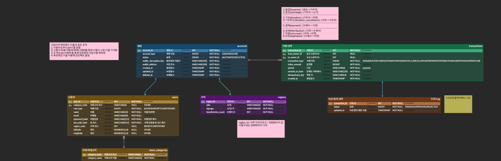
- Swagger API Docs 스크린샷:

  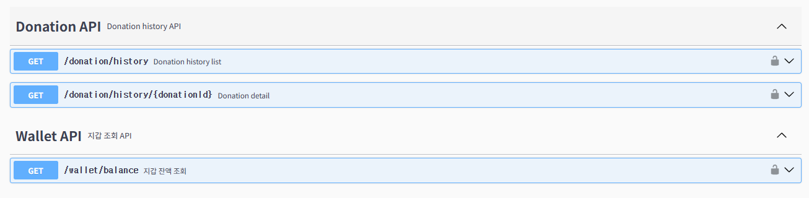
  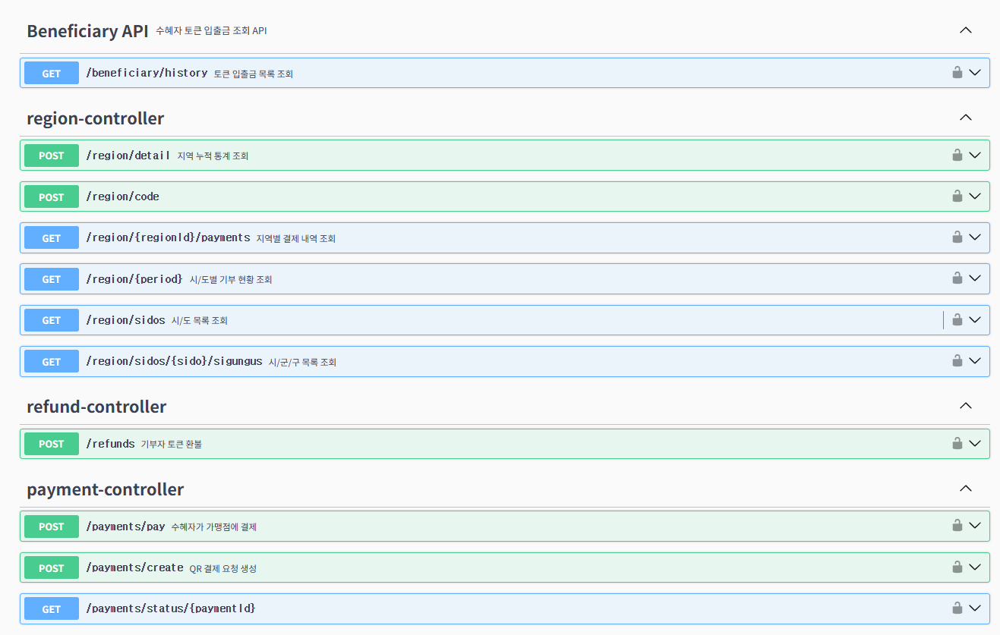
  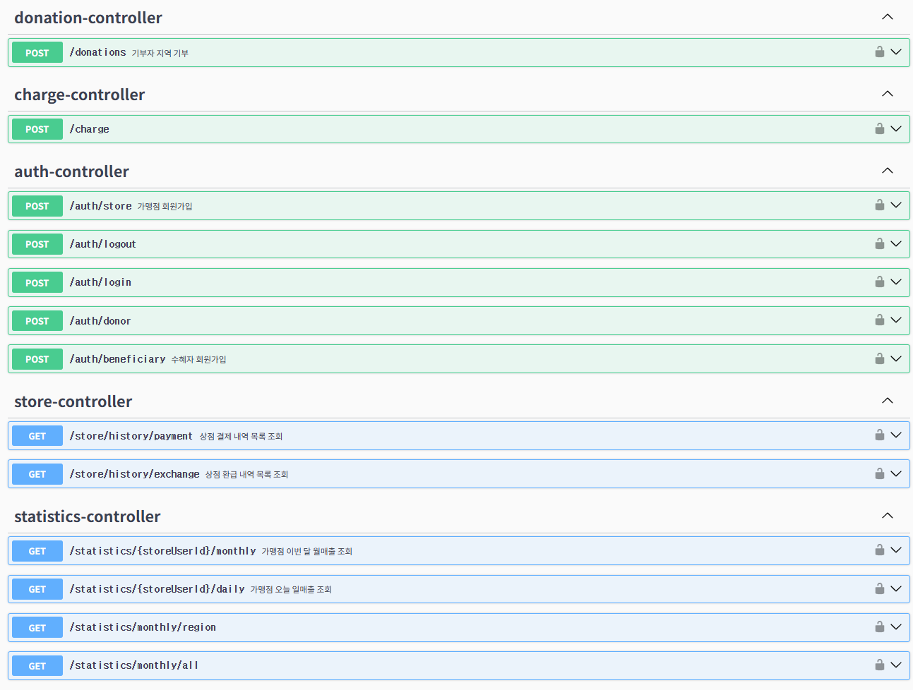

- 영상 포트폴리오: [영상 포트폴리오](https://drive.google.com/file/d/1EDDcfZUcw1u8clD4E0x3XgERb2afjgO7/view?usp=drive_link)
- 기능명세서: [기능명세서](https://www.notion.so/3104c470eb6981d48987fd4b3c54414d)
- API 명세서: [API 명세서](https://www.notion.so/REST-API-3104c470eb6981798e1beaeae32fd982)

---

**참고 파일 / 주요 스크립트**

- 백엔드 빌드: [backend/build.gradle](backend/build.gradle#L1)
- 프론트엔드 패키지: [frontend/package.json](frontend/package.json#L1)
- 블록체인 패키지: [blockchain/package.json](blockchain/package.json#L1)
- AI 요구사항: [fds/requirements.txt](fds/requirements.txt#L1)

---
